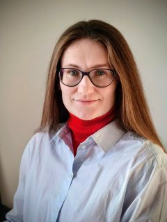

  

    
  

  

   

Ich bin Ingenieurin mit Abschluss in Vermessungswesen und vier Jahren Berufserfahrung im Bereich Geodaten und Katasterwesen in Russland, anerkannt von der Bayerischen Ingenieurekammer-Bau. 
  

  

Meine fachlichen Schwerpunkte liegen in der Arbeit mit Geodaten und GIS, ergänzt durch aktuelle Weiterbildungen in Python, SQL und Power BI.
  

  

  <b>Lebenslauf</b>: 
  <a href="http://rxresu.me/kammerzell/geodatenanalyst" title="Lebenslauf als Webseite öffnen…" target="_blank">Web</a> | 
  <a href="http://rxresu.me/kammerzell/geodatenanalyst" title="Lebenslauf als PDF herunterladen…">PDF</a>
  

  

<h2 id="projects">Projekte</h2>

### Solarparks in Deutschland

  

    
  

  

    

Dieses Projekt demonstriert die Anwendung moderner Geodatenanalyse. Die Präsentation visualisiert die zentralen Ergebnisse und erläutert kurz die methodische Vorgehensweise. Ergänzend zeigen zwei PDF-Layouts praxisnahe Anwendungsbeispiele für die Arbeit mit Raster- und Vektordaten.
   

   

<a href="downloads/file1.pdf">Präsentation</a> | 
<a href="downloads/file2.pdf">Layout 1.</a> | 
<a href="downloads/file2.pdf">Layout 2.</a>
  

<small>

<b>Tools</b>: QGIS, Geopandas, Marp.

<b>Datenquellen</b>: 

<a href="https://gdz.bkg.bund.de/index.php/default/inspire.html">INSPIRE</a>, 
<a href="https://www.marktstammdatenregister.de/MaStR/">Marktstammdatenregister</a>, 
<a href="https://www.dwd.de/DE/leistungen/cdc/cdc_ueberblick-klimadaten.html">DWD</a>, 
<a href="https://zenodo.org/records/14627853">Zenodo</a>, 
<a href="https://naturalearthdata.com">Natural Earth</a>, 
<a href="http://basismap.de">Open Data Länder</a>, 
<a href="https://www.openstreetmap.org">OpenStreetMap</a> 
(volle Liste in den Dateien).

</small>

  

## Leistungen

 - Erstellung der digitalen und druckbaren Karten.
 - Visualisieren der Geodaten, Erstellung der Infografik.
 - Entwicklung der geodatenorientierten Web-Applikationen.
 - Vektordatenanalyse.
 - Rasterdatenanalyse.
 - Netzwerkanalyse.
 - Automatosierung der Workflows mit Python (PyQGIS, Geopandas). 
 - Design und Verwaltung von PostGIS/SQL-Datenbanken zur effizienten Speicherung und Abfrage von Geodatensätzen.

## Werkzeuge

 - [QGIS](https://qgis.org)
 - [ArcGIS](https://www.arcgis.com)
 - [Streamlit](https://streamlit.io/)
 - [MapInfo Pro](https://www.precisely.com/product/precisely-mapinfo/mapinfo-pro)
 - Python, Geopandas
 - PostreSQL / PostGIS
 - Visual Studio Cide
 - Git
 - Linux (WSL)

## Mitgliedschaft

 - [Runder Tisch GIS e.V.](https://www.rundertischgis.de/)

## Zertifizierungen

 - **Anerkennung als Ingenieurin**
   
   Bayerische Ingenieurekammer-Bau, München, 2024

 - **Katasteringenieurin**
 
   Agentur für Vermögensverwaltung, Perm, Russland, 2012

## Bildung

 - **Grund- u. Aufbaukurs QGIS**
   
   [cimdata Bildungsakademie](https://cimdata.de/weiterbildung/gis-qgis-aufbaukurs), 2026
 - **Geispatiale Datenanalyse mit Python**
 
   [DataCamp](https://www.datacamp.com/portfolio/nkmzl), 2025

 - **Abschluß als Dipl. Vermessungsingenieur**
 
   Nationale Polytechnische Forschungsuniversität Perm, 2010

## Persönliches

 - Geb. in Russland
 - Seit 2021 in Herrsching am Ammersee, Deutschland

## Kontakte

 - Profil auf [LinkedIn](www.linkedin.com/in/geotrixi)
 - [Schreiben Sie mir](mailto:n@kmzl.de)

